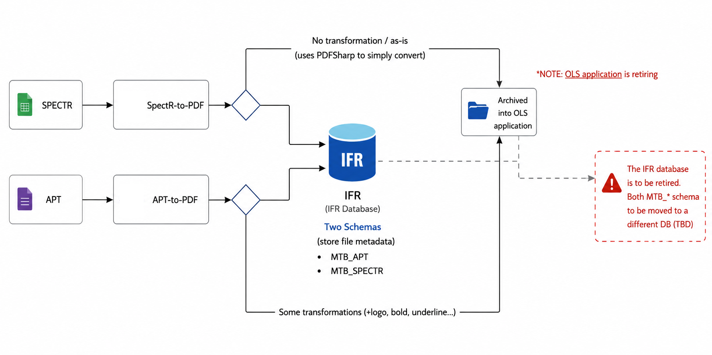
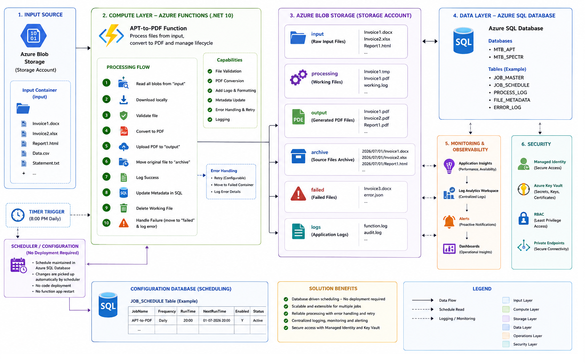

# APT-to-PDF Azure Modernization

**Technical Design Document**\
**Version:** 1.0

------------------------------------------------------------------------

## Overview

APT-to-PDF is an Azure Function-based document processing solution that
modernizes the existing workflow using Azure-native services while
preserving the current business process. This document complements the
High Level Design and focuses on implementation details.

------------------------------------------------------------------------

## Architecture

  Component                  Responsibility
  -------------------------- ---------------------------------------------
  Azure Function (.NET 10)   Orchestrates document processing
  Azure Blob Storage         Stores input, output and archived documents
  Azure SQL Database         Stores metadata and processing status
  Azure Key Vault            Secure secret management
  Managed Identity           Passwordless authentication
  Application Insights       Telemetry and diagnostics
  Log Analytics              Centralized monitoring

> **Architecture Diagram**

``` md



```

------------------------------------------------------------------------

## Processing Workflow

1.  Timer Trigger starts the scheduled execution.
2.  Azure Function reads documents from Blob Storage.
3.  Input files are validated.
4.  Documents are converted to PDF.
5.  Generated PDFs are uploaded to the output container.
6.  Processing metadata is updated in Azure SQL Database.
7.  Source files are archived.
8.  Telemetry and execution logs are written.

------------------------------------------------------------------------

## Solution Structure

``` text
src/
├── Functions/
├── Services/
├── Repositories/
├── Models/
├── Configuration/
├── Infrastructure/
└── Tests/
```

------------------------------------------------------------------------

## Configuration

  Setting            Purpose
  ------------------ -----------------------
  StorageAccount     Azure Storage Account
  InputContainer     Source documents
  OutputContainer    PDF output
  ArchiveContainer   Archive location
  SqlConnection      Azure SQL Database
  KeyVaultUri        Secret management

------------------------------------------------------------------------

## Security

-   Managed Identity authentication
-   Azure Key Vault integration
-   Role-Based Access Control (RBAC)
-   HTTPS-only communication

------------------------------------------------------------------------

## Monitoring

-   Application Insights
-   Azure Monitor
-   Log Analytics

**Key Metrics**

-   Processing time
-   Success rate
-   Failure count
-   Function execution duration

------------------------------------------------------------------------

## Deployment

Deployment is automated through Azure DevOps.

``` text
Restore
   ↓
Build
   ↓
Unit Test
   ↓
Publish
   ↓
Deploy
   ↓
Smoke Test
```

------------------------------------------------------------------------

## Operational Guidelines

  Area         Recommendation
  ------------ ------------------------------------------
  Retry        Exponential retry for transient failures
  Logging      Structured logging with Correlation ID
  Scaling      Consumption or Premium plan
  Secrets      Store only in Azure Key Vault
  Monitoring   Configure Azure Monitor alerts

------------------------------------------------------------------------

## Troubleshooting

  Issue                    Resolution
  ------------------------ ----------------------------------------
  Blob access failure      Verify Managed Identity permissions
  SQL connection failure   Validate Key Vault secret and firewall
  Function timeout         Review execution time and scaling
  PDF conversion failure   Review application logs and input file

------------------------------------------------------------------------

## Future Enhancements

-   Event Grid integration
-   Durable Functions
-   Parallel document processing
-   Automated alerting
-   Dashboard reporting

------------------------------------------------------------------------

**End of Document**
