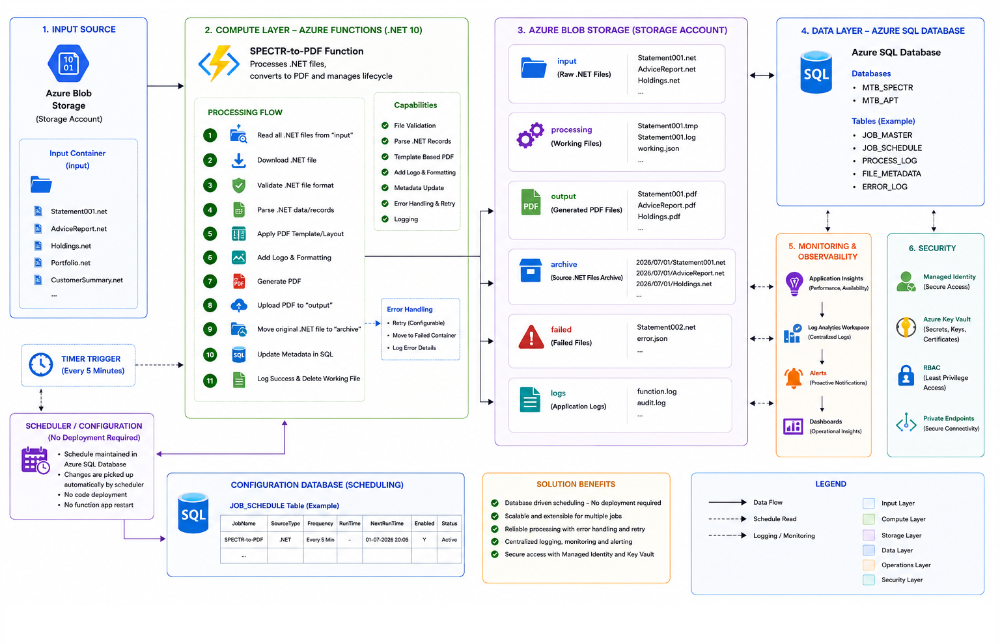

# Professional Technical Design

# SPECTR-to-PDF Solution -- Azure (.NET 10)

**Version:** 1.0\
**Document Type:** Technical Design Document (TDD)

------------------------------------------------------------------------

## 1. Overview

The SPECTR-to-PDF solution modernizes the existing .NET document
conversion application using Azure-native services and Azure Functions
(.NET 10). The solution processes source files from Azure File Storage,
converts them into PDF documents, stores processing metadata in Azure
SQL Database, archives processed files, and provides centralized
monitoring, security, and scheduling.

------------------------------------------------------------------------

## 2. Solution Architecture

> Include the architecture diagram below in GitHub or Azure DevOps
> documentation.

``` md

```

### Architecture Components

  Layer           Responsibility
  --------------- -----------------------------------------------------
  Input Source    Azure File Storage (Input Share)
  Compute Layer   Azure Function (.NET 10)
  Storage         Input, Processing, Output, Archive, Failed and Logs
  Database        Azure SQL Database (IFR_V2)
  Monitoring      Application Insights & Log Analytics
  Security        Managed Identity, Azure Key Vault & RBAC

------------------------------------------------------------------------

## 3. Processing Workflow

    Step Activity
  ------ ---------------------------------------------------
       1 Read .NET files from Input Share
       2 Download source files
       3 Validate .NET file format
       4 Parse .NET records
       5 Apply PDF template and layout
       6 Generate PDF
       7 Upload PDF to Output Share
       8 Archive original .NET files
       9 Update processing metadata in Azure SQL
      10 Log successful execution and delete working files

------------------------------------------------------------------------

## 4. Azure File Storage

  Share        Purpose
  ------------ -------------------------------------
  Input        Raw .NET source files
  Processing   Temporary working files
  Output       Generated PDF files
  Archive      Successfully processed source files
  Failed       Failed processing files
  Logs         Function and audit logs

------------------------------------------------------------------------

## 5. Database Design

**Database:** `IFR_V2`

Primary Business Table

-   MTB_SPECTR

Operational Tables

-   JOB_MASTER
-   JOB_SCHEDULE
-   PROCESS_LOG
-   FILE_METADATA
-   ERROR_LOG

------------------------------------------------------------------------

## 6. Security

-   Managed Identity
-   Azure Key Vault
-   Role-Based Access Control (RBAC)
-   Private Endpoints

------------------------------------------------------------------------

## 7. Monitoring

Operational monitoring is implemented using:

-   Application Insights
-   Log Analytics Workspace
-   Azure Monitor Dashboards

Key metrics include:

-   Function execution duration
-   Success and failure rate
-   Processing throughput
-   Error trends

------------------------------------------------------------------------

## 8. Configuration & Scheduling

The job schedule is maintained in Azure SQL Database.

Benefits include:

-   Database-driven scheduling
-   No application redeployment
-   Centralized configuration
-   Dynamic schedule updates

------------------------------------------------------------------------

## 9. Deployment

Deployment is automated using Azure DevOps.

``` text
Restore
   ↓
Build
   ↓
Unit Test
   ↓
Publish
   ↓
Deploy
```

------------------------------------------------------------------------

## 10. Solution Benefits

-   Azure-native architecture
-   Secure authentication using Managed Identity
-   Centralized monitoring and diagnostics
-   Scalable document processing
-   Simplified operations
-   Database-driven scheduling

------------------------------------------------------------------------

## 11. References

-   Azure Functions (.NET 10)
-   Azure Files
-   Azure SQL Database
-   Azure Key Vault
-   Application Insights
-   Azure DevOps
